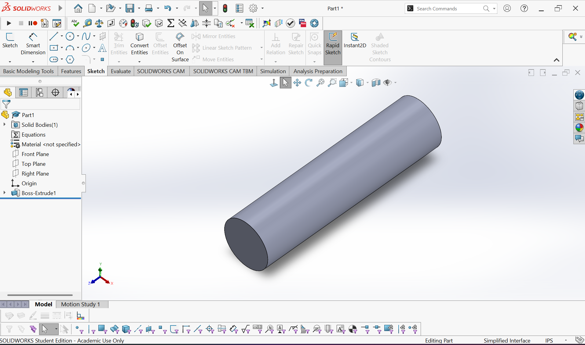

# SolidWorks AI Automation

A Python-based tool that bridges natural language and 3D CAD modeling by integrating
the Claude AI API with the SolidWorks API. Users can describe a part in plain English
and the tool automatically generates the corresponding 3D model in SolidWorks —
eliminating the need for manual sketching and feature creation for common geometries.

Built to explore the intersection of AI, software automation, and mechanical design
as part of my mechatronics engineering portfolio.

---

## Demo



> **Input:** "make a cylinder 50mm wide and 100mm tall"
> **Output:** 3D extruded cylinder created automatically in SolidWorks

---

## How It Works

1. **User Input** — You type a plain English description of a part into the terminal
2. **Claude AI** — The input is sent to the Claude API which parses the intent and extracts structured data (shape, dimensions)
3. **Python Bridge** — The structured data is passed to the SolidWorks API via `pywin32`
4. **SolidWorks** — The part is automatically sketched and extruded in SolidWorks with no manual input

---

## Tech Stack

| Tool | Purpose |
|------|---------|
| Python 3.11+ | Core programming language |
| Claude API (Anthropic) | Natural language parsing |
| SolidWorks API | 3D CAD automation |
| pywin32 | Windows COM bridge to SolidWorks |
| python-dotenv | Environment variable management |

---

## Setup & Installation

### Prerequisites
- Windows OS
- SolidWorks 2025 installed
- Python 3.11+
- Anthropic API key

### Steps

**1. Clone the repository**
```bash
git clone https://github.com/MinaA-07/solidworks-ai-automation.git
cd solidworks-ai-automation
```

**2. Create and activate virtual environment**
```bash
python -m venv venv
venv\Scripts\activate
```

**3. Install dependencies**
```bash
pip install -r requirements.txt
```

**4. Add your API key**

Create a `.env` file in the root directory:
ANTHROPIC_API_KEY = YOUR API KEY

**5. Run the tool**

Make sure SolidWorks is open with no documents, then:
```bash
python -m src.main
```

**6. Type a command**

---

## Supported Shapes

| Shape | Example Command |
|-------|----------------|
| Cylinder | "make a cylinder 50mm wide and 100mm tall" |
| Box | "create a box 100mm wide, 50mm deep and 30mm tall" |

---

## Author

**Mina A.** — Mechatronics Engineering, University of Waterloo
- GitHub: [@MinaA-07](https://github.com/MinaA-07)

---

## License

MIT License — see [LICENSE](LICENSE) for details.